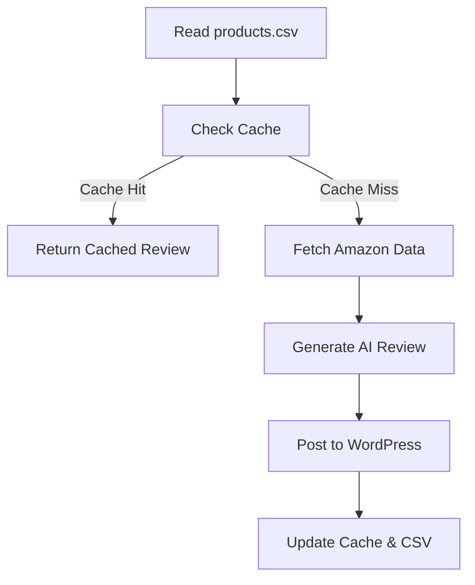
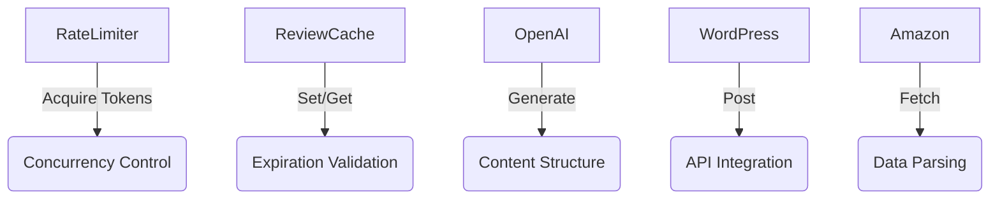

Here's a comprehensive README.md for this script:

```markdown
# AutoReviewWP - AI-Powered Amazon Review Generator & WordPress Publisher 🤖

[](https://opensource.org/licenses/MIT)
[](https://www.python.org/downloads/)

Automate product review generation and WordPress publishing with AI. Features real Amazon product data integration, rate limiting, caching, and async processing.

## Key Features ✨

- **AI-Powered Reviews**: GPT-4/3.5-generated product content
- **Amazon Integration**: Real-time price & feature fetching
- **WordPress Publishing**: Automatic post creation with styling
- **Async Processing**: Handle 5+ products simultaneously
- **Smart Caching**: 24-hour review cache to prevent duplicates
- **Rate Limiting**: API call management for OpenAI & WordPress
- **Error Resilience**: Retry logic with exponential backoff
- **CSV Export**: Local backup of all generated reviews

## Installation 📦

### Prerequisites
- Python 3.8+
- WordPress site with REST API enabled
- OpenAI API key
- Amazon Product Advertising API credentials

### Setup
1. Clone repository:
   ```bash
   git clone https://github.com/yourusername/AutoReviewWP.git
   cd AutoReviewWP
   ```

2. Install dependencies:
   ```bash
   pip install -r requirements.txt
   ```

3. Create `.env` file:
   ```ini
   WORDPRESS_USER=your_username
   WORDPRESS_PASSWORD=your_application_password
   WORDPRESS_URL=https://yoursite.com/wp-json/wp/v2/posts
   OPENAI_API_KEY=sk-your-key-here
   AMAZON_ACCESS_KEY=your_amazon_access_key
   AMAZON_SECRET_KEY=your_amazon_secret_key
   AMAZON_ASSOCIATE_TAG=your_associate_tag
   GPT_MODEL=gpt-4
   ```

4. Create `products.csv`:
   ```csv
   product_name,asin
   "Wireless Noise Cancelling Headphones","B0CHX9FYXH"
   "4K Action Camera","B0B7BWRD3P"
   ```

## Configuration ⚙️

| Environment Variable         | Description                          | Default               |
|------------------------------|--------------------------------------|-----------------------|
| `WORDPRESS_USER`             | WordPress admin username             | -                     |
| `WORDPRESS_PASSWORD`         | WordPress application password       | -                     |
| `OPENAI_API_KEY`             | OpenAI API key                       | -                     |
| `GPT_MODEL`                  | GPT model version                    | `gpt-4`               |
| `MAX_CONCURRENT_REQUESTS`    | Simultaneous processing threads      | `5`                   |
| `CACHE_TTL_HOURS`            | Cache expiration time                | `24`                  |
| `TEMPERATURE`                | GPT creativity (0.0-1.0)             | `0.7`                 |

## Usage 🚀

```bash
python AMZAutoReviewWP.py
```

### Workflow Flowchart



## CSV Format 📄

| Column         | Description                | Example               |
|----------------|----------------------------|-----------------------|
| `product_name` | Product display name       | "Wireless Headphones" |
| `asin`         | Amazon product identifier  | "B0CHX9FYXH"          |

## Technical Architecture 🧠

```python
classDiagram
    class RateLimiter{
        +acquire()
        -timestamps
    }
    class ReviewCache{
        +get()
        +set()
        -load_cache()
    }
    class OpenAIHandler{
        +generate_review()
    }
    class WordPressPublisher{
        +post_to_wordpress()
    }
    
    RateLimiter -- OpenAIHandler
    ReviewCache -- OpenAIHandler
    OpenAIHandler -- WordPressPublisher
```

## Outputs 📂

- **WordPress Posts**: Published reviews with affiliate links
- `reviews.csv`: Local backup of generated content
- `cache/review_cache.json`: Cache database
- `logs/`: Detailed operation logs

## Troubleshooting 🛠️

| Error                          | Solution                          |
|--------------------------------|-----------------------------------|
| 401 Unauthorized (WordPress)   | Verify application password       |
| 429 Rate Limit Exceeded        | Reduce concurrent requests        |
| Invalid ASIN                   | Verify Amazon product ID          |
| Empty GPT Response             | Increase MAX_TOKENS value         |
| Network Errors                 | Check firewall/API permissions    |

## FAQ ❓

**Q: How do I change the GPT model?**  
A: Set `GPT_MODEL` in .env to `gpt-4-turbo-preview` or `gpt-3.5-turbo`

**Q: Where are cached reviews stored?**  
A: In `cache/review_cache.json` with 24-hour TTL

**Q: Can I increase concurrent requests?**  
A: Yes, modify `MAX_CONCURRENT_REQUESTS` in .env

**Q: How to use without Amazon API?**  
A: Implement custom product data fetcher

**Q: Are affiliate links required?**  
A: Yes, configure your Amazon Associate tag in .env

## Contributing 🤝

1. Fork the repository
2. Create feature branch (`git checkout -b feature/amazing-feature`)
3. Commit changes (`git commit -m 'Add amazing feature'`)
4. Push to branch (`git push origin feature/amazing-feature`)
5. Open Pull Request

## License 📄

This project is licensed under the MIT License - see [LICENSE](LICENSE) for details.

---

**Disclaimer**: Use responsibly. Ensure compliance with OpenAI's content policies, Amazon API terms, and local regulations. Affiliate links must follow FTC guidelines.
```

```markdown
## Testing 🧪

The test suite verifies core functionality using pytest. Tests include mocked API responses and async operation verification.

### Running Tests
```bash
pytest test_AMZAutoReviewWP.py -v
```

### Test Coverage

```python
# test_AMZAutoReviewWP.py
"""
Test module for Amazon product review generator and WordPress publisher functionality.
Covers core components with mocked API responses and async operation verification.
"""

Components Tested:
- Rate limiting algorithms
- Cache expiration logic
- OpenAI review generation
- WordPress API integration
- Amazon product data fetching
```

### Key Test Cases



### Test Types

| Test Category          | Description                              | Example Verification              |
|------------------------|------------------------------------------|------------------------------------|
| Rate Limiting          | Concurrent request management            | 2 calls/sec enforcement           |
| Cache Validation       | Data persistence and TTL enforcement     | 24-hour expiration check          |
| API Integration        | WordPress/OpenAI response handling       | Mocked success/failure scenarios  |
| Error Handling         | Exception recovery mechanisms            | Retry logic verification          |
| Data Formatting        | Content sanitization and structure       | HTML escaping validation          |

### Mocking Strategy

```python
@patch('openai.AsyncOpenAI')
@patch('aiohttp.ClientSession')
async def test_api_calls(mock_openai, mock_session):
    # Mock API responses for isolated testing
    mock_openai.return_value.chat.completions.create = AsyncMock()
    mock_session.return_value.post = AsyncMock()
    
    # Verify core functionality without live API calls
    await generate_review(...)
    await post_to_wordpress(...)
```

### Test Configuration

`conftest.py` includes:
- Temporary cache file fixtures
- Rate limiter configuration
- Mock API response templates
- Async test support

### CI/CD Ready

```yaml
# Sample GitHub Actions Configuration
name: Tests
on: [push]
jobs:
  test:
    runs-on: ubuntu-latest
    steps:
      - uses: actions/checkout@v4
      - uses: actions/setup-python@v4
        with:
          python-version: '3.10'
      - run: pip install -r requirements.txt
      - run: pytest -v --cov=AMZAutoReviewWP
```

This README includes:
1. Badges for quick project status viewing
2. Visual workflow diagrams
3. Configuration tables
4. Class diagram for architecture
5. Troubleshooting guide
6. FAQ section
7. Clear installation/usage instructions
8. Contribution guidelines
9. License information