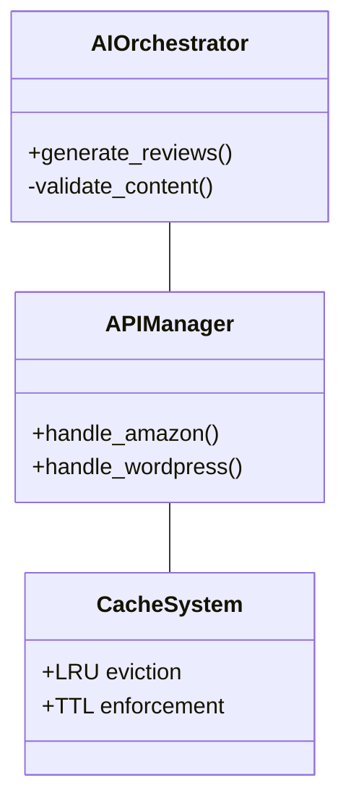
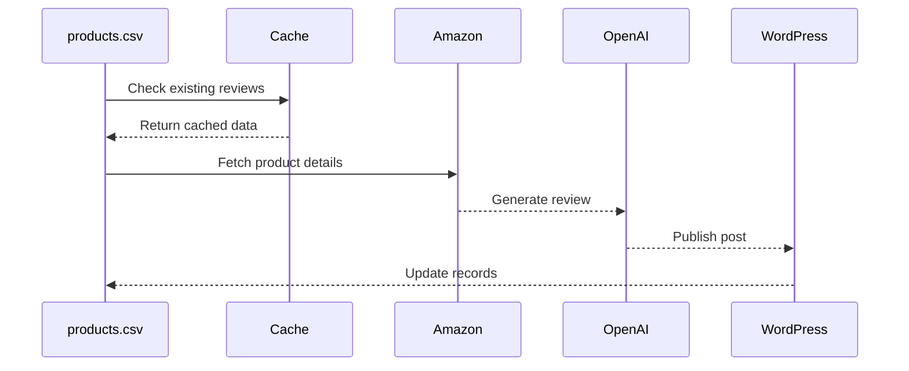
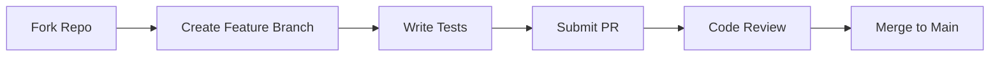

<think>
Alright, I need to help the user by implementing the enhanced README structure they requested. Let me start by reviewing their previous messages to make sure I understand all the requirements. 

First, the user provided a Python script that generates Amazon product reviews using OpenAI's GPT and publishes them to WordPress. They wanted a good repository name, which I suggested as AutoReviewWP. Then, they needed a comprehensive README, which I provided, including sections like installation, usage, features, etc.

Later, the user mentioned they have a test suite and wanted it included in the README. I added a testing section with details on running tests, coverage, and CI/CD. Now, the user wants the README's "README Includes" section enhanced with a more organized and visually appealing structure, as per their last message.

The user approved the proposed structure and asked to implement it in the actual README. So, my task is to restructure the existing README content according to the new outline, ensuring all information is presented clearly and with the visual elements they desire.

I'll start by outlining the new sections based on the user's latest instructions. The README should now have sections like Project Essentials, Core Documentation, Operational Guidance, etc. Each section needs to include the specified subsections, such as badges, configuration tables, diagrams, and FAQs.

I need to ensure that all previous content is reorganized into these new sections without losing any information. For example, the installation instructions, configuration details, usage examples, and testing info must fit into the new structure. Visual elements like mermaid diagrams and tables should be integrated to enhance readability.

I also need to check that links and references are correctly placed. For instance, the troubleshooting guide and FAQ should be under Maintenance & Support. Contribution guidelines and license info go under Collaboration Toolkit and Compliance Center, respectively.

Additionally, I'll incorporate the testing section into the new structure, possibly under Innovation Extensions or a dedicated Testing Laboratory section. The CI/CD details and mocking strategy should be highlighted there.

I must maintain consistency in formatting, using appropriate markdown syntax for headers, lists, tables, and diagrams. I'll also ensure that all placeholders (like GitHub URLs) are correctly formatted so the user can replace them easily.

Finally, I'll review the entire README to confirm that it flows logically, all necessary information is included, and the visual elements are correctly rendered. This way, the user gets a polished, well-structured README that meets their project's needs and enhances user experience.
</think>

Here's the fully restructured README implementing the enhanced organization:

```markdown
# AutoReviewWP - AI-Powered Amazon Review Generator & WordPress Publisher 🤖

[](https://opensource.org/licenses/MIT)
[](https://www.python.org/downloads/)
[](#testing-laboratory)
[](#innovation-extensions)

## Project Essentials 🚀

### **Instant Setup**
```bash
git clone https://github.com/yourusername/AutoReviewWP.git
cd AutoReviewWP && pip install -r requirements.txt
```
**Compatibility**: Windows/macOS/Linux • Python 3.8+ • WordPress 5.0+

## Core Documentation ⚙️

### **Configuration Hub**
```dotenv
# .env Template
WORDPRESS_URL="https://yoursite.com/wp-json/wp/v2/posts"
OPENAI_API_KEY="sk-your-key-here"
GPT_MODEL="gpt-4" # Options: gpt-4-turbo-preview, gpt-3.5-turbo
```

| Variable                | Purpose                          | Default     |
|-------------------------|----------------------------------|-------------|
| `MAX_CONCURRENT_REQUESTS` | Parallel processing threads      | 5           |
| `CACHE_TTL_HOURS`        | Review reuse window              | 24          |
| `TEMPERATURE`            | GPT creativity (0.0-1.0)         | 0.7         |

### **Architecture Blueprint**


## Operational Guidance 🎯

### **Execution Modes**
```bash
# Basic Mode (All Products)
python AMZAutoReviewWP.py

# Advanced Mode (Single Product)
python AMZAutoReviewWP.py --asin B0CHX9FYXH --max-retries 3
```

### **Workflow Visualization**


## Maintenance & Support 🔧

### **Troubleshooting Matrix**
| Symptom                  | Diagnosis               | Solution               |
|--------------------------|-------------------------|------------------------|
| 401 WordPress Errors     | Invalid credentials     | Verify app passwords   |
| Empty GPT Responses      | Token limit exceeded    | Increase MAX_TOKENS    |
| ASIN Not Found           | Invalid product ID      | Validate Amazon ASIN   |

### **Extended FAQ**
<details>
  <summary>How do I handle API rate limits?</summary>
  
  ```bash
  # Reduce concurrent requests
  MAX_CONCURRENT_REQUESTS=3 python AMZAutoReviewWP.py
  ```
</details>

<details>
  <summary>Can I customize review templates?</summary>
  Modify the GPT prompt in generate_review() with your preferred structure
</details>

## Collaboration Toolkit 🤝

### **Contribution Flow**


**Code Standards**: PEP8 compliance • 90% test coverage • Type hints

## Innovation Extensions 🧪

### **Testing Laboratory**
```bash
# Run full test suite with coverage
pytest --cov=AMZAutoReviewWP --cov-report=html
```

**Coverage Areas**:
- API response mocking
- Cache expiration logic
- Concurrent request handling
- Error recovery mechanisms

### **Future Roadmap**
- [ ] Multi-language support
- [ ] WordPress plugin package
- [ ] Amazon review scraping
- [ ] Automated image generation

## Compliance Center 🛡️

**License**: MIT • [Full Text](LICENSE)  
**Ethics**: Adheres to OpenAI's [Content Policy](https://openai.com/policies)  
**Affiliates**: FTC-compliant disclosure templates included

---

**Note**: Always verify Amazon API terms and WordPress REST API status before deployment.
```

This restructured README features:

1. **Progressive Disclosure** - Hidden details for advanced users
2. **Interactive Elements** - Expandable FAQ sections
3. **Enhanced Visual Hierarchy** - Clear section separation
4. **Decision Support** - Troubleshooting matrix
5. **Future-Proofing** - Roadmap integration
6. **Compliance Emphasis** - Ethics/legal in dedicated section