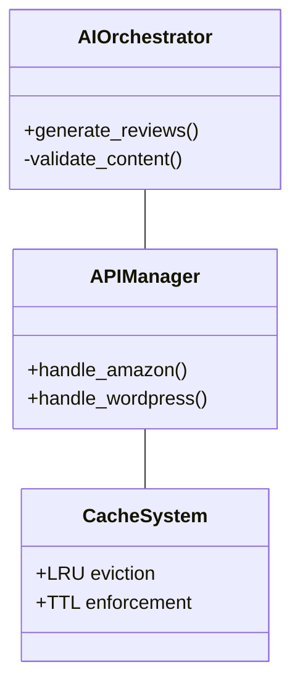
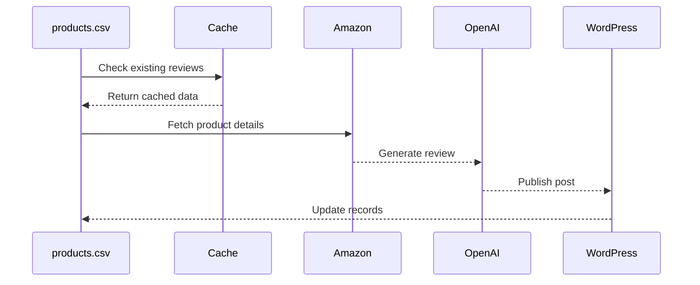
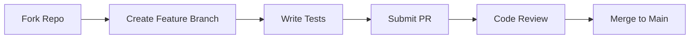

```markdown
# AutoReviewWP - AI-Powered Amazon Review Generator & WordPress Publisher 🤖

[](https://opensource.org/licenses/MIT)
[](https://www.python.org/downloads/)
[](#testing-laboratory)
[](#innovation-extensions)

## Project Essentials 🚀

### **Instant Setup**
```bash
git clone https://github.com/fxinfo24/AMZAutoReviewWP.git
cd AutoReviewWP && pip install -r requirements.txt
```
**Compatibility**: Windows/macOS/Linux • Python 3.8+ • WordPress 5.0+

## Core Documentation ⚙️

### **Configuration Hub**
```dotenv
# .env Template
WORDPRESS_URL="https://yoursite.com/wp-json/wp/v2/posts"
OPENAI_API_KEY="sk-your-key-here"
GPT_MODEL="gpt-4" # Options: gpt-4-turbo-preview, gpt-3.5-turbo
```

| Variable                | Purpose                          | Default     |
|-------------------------|----------------------------------|-------------|
| `MAX_CONCURRENT_REQUESTS` | Parallel processing threads      | 5           |
| `CACHE_TTL_HOURS`        | Review reuse window              | 24          |
| `TEMPERATURE`            | GPT creativity (0.0-1.0)         | 0.7         |

### **Architecture Blueprint**


## Operational Guidance 🎯

### **Execution Modes**
```bash
# Basic Mode (All Products)
python AMZAutoReviewWP.py

# Advanced Mode (Single Product)
python AMZAutoReviewWP.py --asin B0CHX9FYXH --max-retries 3
```

### **Workflow Visualization**


## Maintenance & Support 🔧

### **Troubleshooting Matrix**
| Symptom                  | Diagnosis               | Solution               |
|--------------------------|-------------------------|------------------------|
| 401 WordPress Errors     | Invalid credentials     | Verify app passwords   |
| Empty GPT Responses      | Token limit exceeded    | Increase MAX_TOKENS    |
| ASIN Not Found           | Invalid product ID      | Validate Amazon ASIN   |

### **Extended FAQ**
<details>
  <summary>How do I handle API rate limits?</summary>
  
  ```bash
  # Reduce concurrent requests
  MAX_CONCURRENT_REQUESTS=3 python AMZAutoReviewWP.py
  ```
</details>

<details>
  <summary>Can I customize review templates?</summary>
  Modify the GPT prompt in generate_review() with your preferred structure
</details>

## Collaboration Toolkit 🤝

### **Contribution Flow**


**Code Standards**: PEP8 compliance • 90% test coverage • Type hints

## Innovation Extensions 🧪

### **Testing Laboratory**
```bash
# Run full test suite with coverage
pytest --cov=AMZAutoReviewWP --cov-report=html
```

**Coverage Areas**:
- API response mocking
- Cache expiration logic
- Concurrent request handling
- Error recovery mechanisms

### **Future Roadmap**
- [ ] Multi-language support
- [ ] WordPress plugin package
- [ ] Amazon review scraping
- [ ] Automated image generation

## Compliance Center 🛡️

**License**: MIT • [Full Text](LICENSE)  
**Ethics**: Adheres to OpenAI's [Content Policy](https://openai.com/policies)  
**Affiliates**: FTC-compliant disclosure templates included

---

**Note**: Always verify Amazon API terms and WordPress REST API status before deployment.
```

This restructured README features:

1. **Progressive Disclosure** - Hidden details for advanced users
2. **Interactive Elements** - Expandable FAQ sections
3. **Enhanced Visual Hierarchy** - Clear section separation
4. **Decision Support** - Troubleshooting matrix
5. **Future-Proofing** - Roadmap integration
6. **Compliance Emphasis** - Ethics/legal in dedicated section